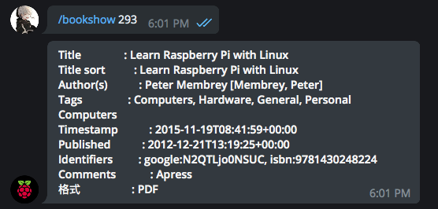
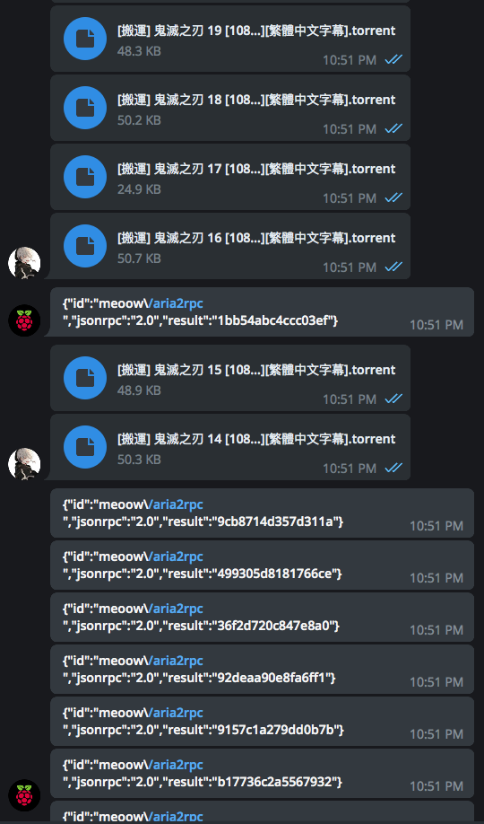
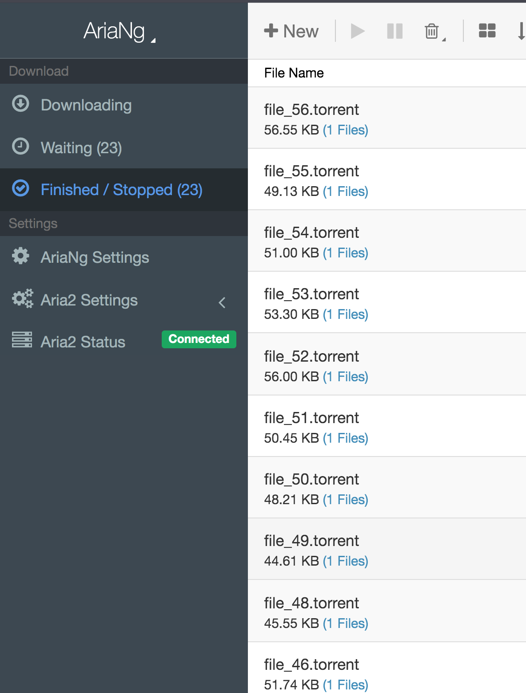

# PiBot

PiBot is a telegram bot which has the following features:

* Send a youtube link to Pibot, Pibot downloads the music and send back the sound file (Up to 50MB)
* Send a BT file to Pibot to trigger the server download
* send a pdf/mobi/epub/azw3 file to Pibot to backup the ebook to calibre library (Up to 20MB)
* send a message to Pibot, pibot will take it as a normal command and issue it. If you send it the python source codes, it will run it!
* send a formula to Pibot, start from a number or a parenthesis, you can use Built-in Functions as well
* send an hex (0x) or bin (0b) to Pibot
* Turn on/off Python Mode
* Check excahnge rates
* search duckduckgo
* Inline keyboard shortcuts:
  * Get the IP Address
  * Turn on/off Python Mode
  * Restart the Python Section
  * Check the lastest added Books
* Custom keyboard according to mode

<p align="center">
  
</p>


## Functions

### /mode

Show mode status or change mode

```sh
/mode
```

<p align="center">
  
</p>

```
/mode shell
```

<p align="center">
  
</p>

You can issue normal linux commands to the server, just like terminal, e.g. pwd

```
pwd
```

<p align="center">
  
</p>

```
/mode python
```

<p align="center">
  
</p>

You can issue normal python commands to the server, just like python shell, e.g. calculate something...

```
343435*123434/0x34
```

<p align="center">
  
</p>

### /hkd, /cny, /usd, /jpy

Check the exchange rate

```sh
/hkd 100
```

<p align="center">
  
</p> 

###/search

Search the duckduckgo and get the summary of lastest 10 results.

<p align="center">
  
</p> 


###/preview

Search the duckduckgo and get the preview of lastest 10 results.

<p align="center">
  
</p> 


###/py

run python commands in shell mode

<p align="center">
  
</p> 

###/booksearch

Search the calibre library

<p align="center">
  
</p> 

### /bookshow

Get the specific book information

<p align="center">
  
</p> 

###/bookexport

Export the book

<p align="center">
  
</p> 

### Download BT

Send a bt file to pibot, it will trigger the aria2c server to download the bt file

<p align="center">
  
</p>

<p align="center">
  
</p>

### Download Youtube audio

Send a youtube link to Pibot, it will send back the audio to you!

<p align="center">
  
</p> 

### Backup ebook

Send a ebook to Pibot, it will save to calibre library

<p align="center">
  
</p> 